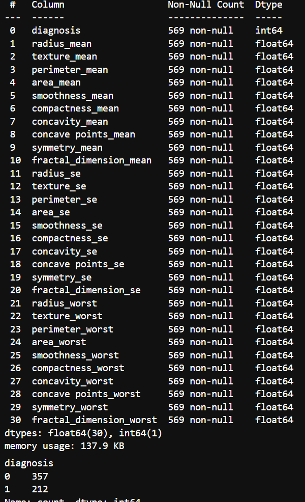
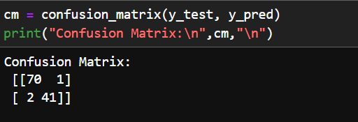
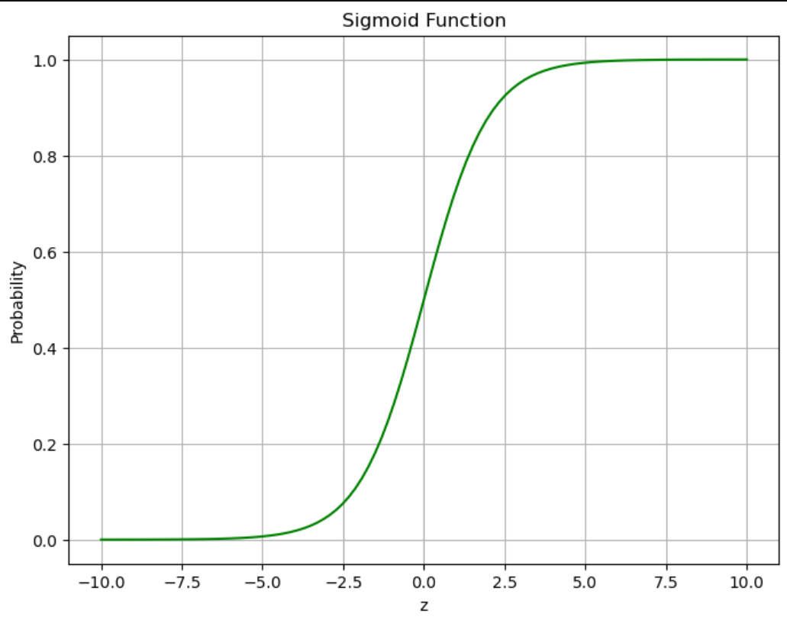

# Breast Cancer Classification – Logistic Regression (Task 4)

## Task Objective  
Build a Logistic Regression model to classify tumor diagnosis (Malignant or Benign) using the Breast Cancer dataset. Evaluate model performance using classification metrics and visualizations.

## 🔧 Tools Used  
- Python  
- Pandas  
- Scikit-learn  
- Matplotlib  
- Seaborn  
- NumPy

## ⚙️ What I Did

1. **Explored the dataset**  
   Used `.info()`, `.head()`, and `.value_counts()` to understand data structure.  
   Found the target column was `diagnosis` (M/B) and removed the `id` and empty `Unnamed: 32` column.

2. **Preprocessed the data**  
   - Mapped `diagnosis` to 0 (Benign) and 1 (Malignant) using `.map()`  
   - Dropped unnecessary columns  
   - Scaled features using `StandardScaler` to normalize input values

3. **Split data for training and testing**  
   - Used `train_test_split()` with 80% train / 20% test  
   - Assigned `X_train`, `X_test`, `y_train`, `y_test`

4. **Trained Logistic Regression model**  
   - Used `LogisticRegression()` and `.fit()`  
   - Made predictions using `.predict()` and `.predict_proba()`

5. **Evaluated model performance**  
   - Used `confusion_matrix()`, `classification_report()`, and `roc_auc_score()`  
   - Model achieved:
     - **Accuracy:** 97%
     - **Precision (Malignant):** 98%
     - **Recall (Malignant):** 95%
     - **ROC-AUC Score:** 0.997 (from my research realised that this score is really impressive)

6. **Plotted ROC Curve**  
   - Used `roc_curve()` and `plt.plot()`  
   - Curve showed very high separation — model is performing almost perfectly

7. **Visualized Sigmoid Function**  
   - Used `1 / (1 + exp(-z))` to plot the sigmoid curve and understand how raw scores turn into probabilities

## 📷 Screenshots

-  – `.info()` and value counts after preprocessing  
-  – 97% accuracy, only 3 misclassified 
-  -
-  -
- – AUC score ~0.997, clean separation  
-  – Shows how logistic regression maps scores to probabilities

## 📁 Files in this Repo

- `breast_cancer_lr.ipynb` – Jupyter notebook with code and results  
- `README.md` – This file  
- `*.png` – Screenshots for evaluation and visuals  
- `data.csv` – Dataset file
